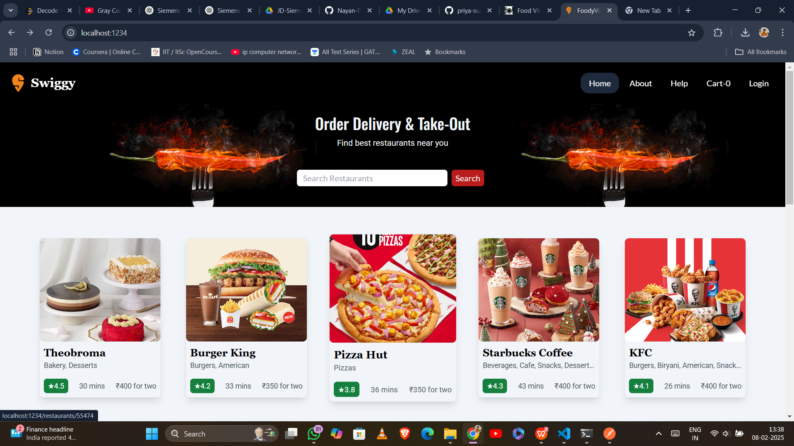

Swiggy Clone – MERN Stack Food Delivery App
This is a Swiggy-inspired food ordering web application built using React.js, Tailwind CSS, and Parcel. It provides a seamless experience for users to browse restaurants, view menus, add items to their cart, and place orders.

Features

✅ Simple Login & Logout – Basic authentication for users.
✅ Restaurant Listings – Browse and filter restaurants.
✅ Cart Management – Add/remove items with a popup cart.
✅ Order Placement – Simple order checkout process.
✅ Error Handling – Dedicated error page.
✅ Shimmer UI – Optimized loading state for a smooth experience.

Future Enhancements
✅ Payment gateway integration
✅ Live order tracking
✅ Restaurant dashboard

Setup & Installation

1. git clone https://github.com/Nayan-Dubey/Swiggy-.git
2. cd swiggy-main 
3. npm install 
4. npm start 

